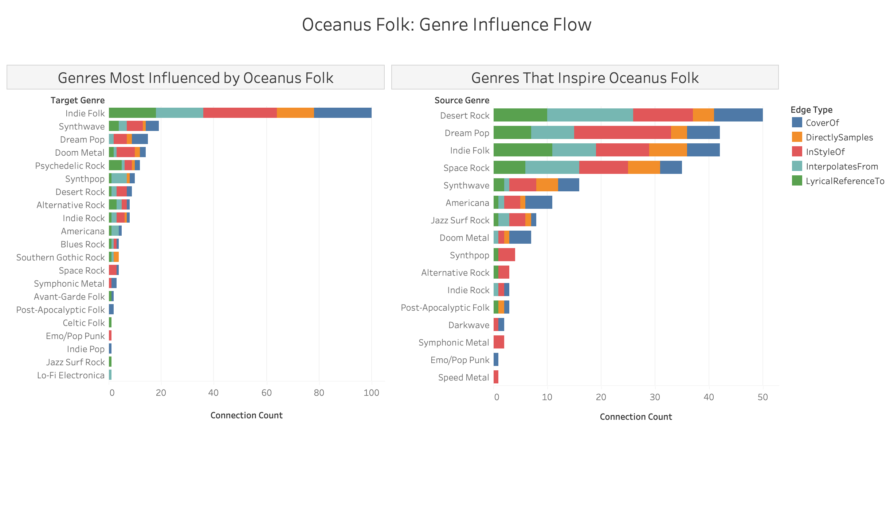
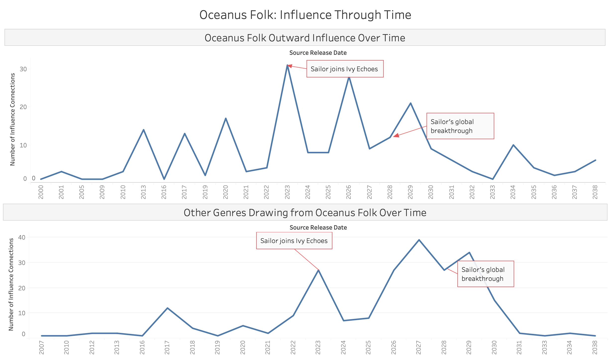
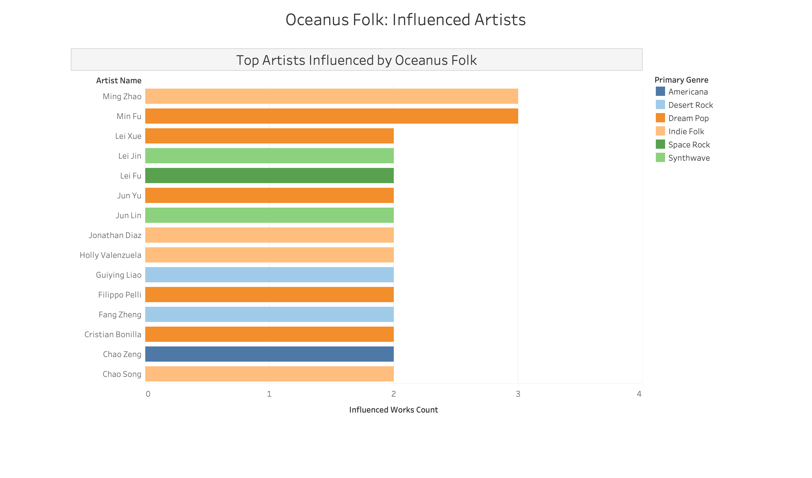

## Data Preparation

The analysis is built on four CSV files derived from the MC1 knowledge graph using a Python preprocessing pipeline:

| File | Description | Rows |
|---|---|---|
| `task2_genre_summary.csv` | Aggregated connection counts between genre pairs, with direction (inbound/outbound) and edge type | 117 |
| `task2_of_influence_out.csv` | Song-level edges where Oceanus Folk works reference works in other genres | 371 |
| `task2_of_influence_in.csv` | Song-level edges where works from other genres reference Oceanus Folk works | 377 |
| `task2_top_artists_influenced.csv` | Artist-level aggregation of top 30 artists most influenced by Oceanus Folk | 30 |

This file was generated using a Python script operating on `lookup_nodes_clean.csv` and `lookup_edges_clean.csv`. The script:

1. Identified all Oceanus Folk song and album node IDs
2. Found all songs/albums from other genres that referenced Oceanus Folk works via InStyleOf, CoverOf, DirectlySamples, InterpolatesFrom or LyricalReferenceTo edges
3. Traced the PerformerOf edges to find the artist behind each influenced song
4. Aggregated the count of influenced works per artist
5. Assigned each artist a primary genre based on whichever genre appeared most frequently in their influenced works
6. Exported the top 30 artists with fields: artist_name, influenced_works_count, notable_works_count, primary_genre

## Genre Influence Flow

{width=100%}

### Left chart — Genres Most Influenced by Oceanus Folk

A horizontal stacked bar chart showing target genres ranked by total connection count. Each color segment represents a different type of musical influence. Longer bar = stronger influence from Oceanus Folk on that genre. Each segment shows how the influence was expressed: CoverOf (Oceanus Folk songs were covered by this genre), DirectlySamples (Oceanus Folk audio was directly sampled), InStyleOf (works were created in the style of Oceanus Folk), InterpolatesFrom (melodies were borrowed from Oceanus Folk), LyricalReferenceTo (lyrics referenced Oceanus Folk works). The genres are sorted from most to least influenced — Indie Folk at the top is the most influenced genre.

### Right chart — Genres That Inspire Oceanus Folk

Same chart structure but showing which genres feed INTO Oceanus Folk. If a genre appears prominently on both sides it means there is a two-way musical exchange with Oceanus Folk. Desert Rock, Dream Pop and Indie Folk appearing on both sides confirms they have a bidirectional relationship with Oceanus Folk.

## Influence Through Time

{width=100%}

### Top chart — Oceanus Folk Outward Influence Over Time

A line chart where each point represents the number of influence connections made by Oceanus Folk works in that year. Higher points mean more Oceanus Folk works were influencing other genres that year. Two key events are marked directly on the chart: "Sailor joins Ivy Echoes" (2023) — marks the dramatic spike in outward influence; "Sailor's global breakthrough" (2028) — marks the second wave of sustained influence. The overall pattern shows influence was low and scattered before 2020, then triggered by Sailor's career milestones.

### Bottom chart — Other Genres Drawing from Oceanus Folk Over Time

Same structure but showing when OTHER genres started drawing from Oceanus Folk. The top chart shows when Oceanus Folk influenced others, the bottom shows when others started recognising and drawing back from Oceanus Folk. The start date difference is notable — the top chart starts from 2000 but the bottom starts from 2007, showing a 7-year lag before external genres began referencing Oceanus Folk. The 2028 peak on the bottom chart is even more pronounced than on the top — confirming Sailor's breakthrough was the key trigger for external recognition.

## Top Influenced Artists

{width=100%}

A horizontal bar chart of the top 15 artists whose works were most influenced by Oceanus Folk, colored by their primary genre. Longer bar = more works influenced by Oceanus Folk. Each color represents the artist's primary genre, showing which genre communities were most receptive to Oceanus Folk's influence. The even bar lengths — most artists have 2–3 influenced works — confirm that Oceanus Folk's impact was broadly distributed across many artists rather than concentrated on a few. Dream Pop and Desert Rock dominate the top 15, consistent with the genre-level findings in the Genre Influence Flow dashboard.

## Bidirectional Genre Flow (Sankey Diagram)

{width=100%}

A flow diagram showing the two-way musical influence between Oceanus Folk and other genres simultaneously. Left blue node (Oceanus Folk → Outward) represents Oceanus Folk sending influence to other genres. Right purple node (Inward → Oceanus Folk) represents other genres sending influence back to Oceanus Folk. Middle nodes are individual genres positioned between the two anchor nodes. Band thickness indicates strength — thicker bands = stronger influence relationship. Orange nodes indicate genres with two-way exchange (both receiving and giving influence). Light blue nodes are genres that only receive influence from Oceanus Folk. Red/pink nodes are genres that only give influence to Oceanus Folk.

## Key Analytical Findings

| Question | Finding |
|---|---|
| Was influence gradual or intermittent? | Triggered — spiked dramatically in 2023 and 2028 aligned with Sailor's career milestones |
| Which genres were most influenced? | Indie Folk (~100 connections), followed by Synthwave, Dream Pop and Doom Metal |
| Which artists were most influenced? | Influence broadly distributed across 483 artists — no single dominant recipient |
| What inspires Oceanus Folk? | Desert Rock, Dream Pop, Indie Folk and Space Rock are the strongest inbound influences |
| Is the exchange bidirectional? | Yes — Indie Folk, Desert Rock, Dream Pop and Space Rock all show two-way exchange |
| When did external recognition begin? | 2007 — seven years after Oceanus Folk began referencing other genres in 2000 |
