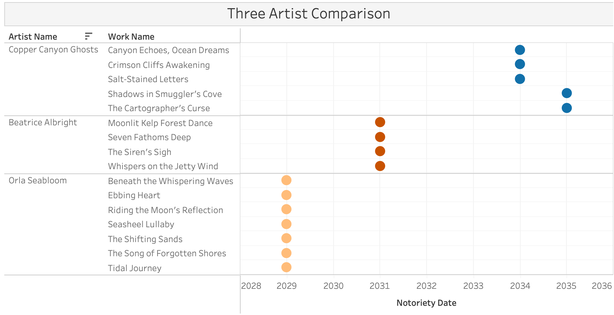

This guide explains how to interact with each Tableau dashboard and Python-generated visualisation on this website. Each section opens with a screenshot of the dashboard followed by a walk-through of what the chart shows, how to read it, and what interactions are available.

## Task 1 — Sailor Shift Career Profile

### Dashboard 1 — Sailor's Influence & Collaborations

{width=100%}

::: {.callout-warning}
**TODO — Klara:** Replace this screenshot after Tableau graph titles and colours are updated.
:::

This dashboard combines three charts: Collaborations Over Time (top), Genre Influences (bottom-left), and Direct & Indirect Influence (bottom-right).

**Top chart — Sailor Shift's Collaborations Over Time.** Each row is a collaborator, each square is the year of a collaboration, and the colour indicates the collaboration type (Composer, Lyricist, Performer, Producer). Multiple squares on the same row mean the collaborator worked with Sailor more than once. Hover over any square to see the collaborator name, work title, and release year. Use the **Ivy Echoes Members** filter on the right to isolate only Ivy Echoes bandmates and compare their activity against the broader collaborator pool. The Ivy filter toggles between 0 (non-members) and 1 (members).

**Bottom-left chart — What Genres Has Influenced Sailor Shift The Most?** Each dot represents one influence relationship between a Sailor work (X-axis = release year) and its source genre (Y-axis). Colour indicates the influence type: Cover, Direct Sample, Inspired by Style, Lyrical Reference, or Melody Interpolation. Hover over any dot for the exact work name and genre. The filter on `Sailor Work Release Year` lets you narrow the time range.

**Bottom-right chart — Direct & Indirect Influence.** Each bar represents a person or group that referenced Sailor's work or her collaborators' work. Bar length shows the number of documented influence connections. Hover over any bar segment to see the entity name and influence type breakdown.

### Dashboard 2 — Sailor's Impact on Oceanus Folk

{width=100%}

::: {.callout-warning}
**TODO — Klara:** Replace this screenshot after Tableau graph titles and colours are updated.
:::

This dashboard combines two charts: Oceanus Folk Production Over Time (left) and Top Contributors After 2028 (right).

**Left chart — Oceanus Folk Production in Sailor Shift's Circle Over Time.** Each bar represents the number of distinct Oceanus Folk works released that year within Sailor's collaborative network. The vertical dashed line marks 2028 (her breakthrough). Colours distinguish three eras: Before Breakthrough (blue), Breakthrough Year (orange), and After Breakthrough (dark grey). Hover over any bar for the exact count and year.

**Right chart — Top Oceanus Folk Contributors in Sailor's Circle After 2028.** A horizontal bar chart ranking artists by the number of OF works they produced after 2028. Colour distinguishes Ivy Echoes members (purple) from other collaborators (grey). The **Era** filter is pre-set to "After Breakthrough" — this filter controls both charts, so changing it will update the left chart as well. The **Artist Name** filter restricts which artists appear.

### Interactive Influence Network (Python)

An interactive HTML influence network graph is embedded below the Tableau dashboards on the Task 1 analysis page.

**Influence Network.** A directed graph showing the full influence chain: Sailor (gold star), her works (orange dots), collaborators (blue), Ivy Echoes members (green), and artists inspired by Sailor or her circle (purple). Arrows indicate the direction of influence. Click any node to highlight its neighbourhood. Hover for details including genre and release year.

---

## Task 2 — Oceanus Folk Genre Spread

### Dashboard 1 — Genre Influence Flow

{width=100%}

::: {.callout-warning}
**TODO — Klara:** Replace this screenshot after Tableau graph titles and colours are updated.
:::

This dashboard shows which genres Oceanus Folk most influenced (left chart) and which genres most inspired Oceanus Folk (right chart).

**Left chart — Genres Most Influenced by Oceanus Folk.** A horizontal stacked bar chart showing target genres ranked by total connection count. Each colour segment represents a different type of musical influence: CoverOf, DirectlySamples, InStyleOf, InterpolatesFrom, and LyricalReferenceTo. Longer bar = stronger influence from Oceanus Folk on that genre. Hover over any bar segment to see the exact connection count for that edge type and genre. The genres are sorted from most to least influenced.

**Right chart — Genres That Inspire Oceanus Folk.** Same chart structure but showing which genres feed into Oceanus Folk. Compare left vs right — if a genre appears prominently on both sides it means there is a two-way musical exchange with Oceanus Folk.

### Dashboard 2 — Influence Through Time

{width=100%}

::: {.callout-warning}
**TODO — Klara:** Replace this screenshot after Tableau graph titles and colours are updated.
:::

This dashboard shows how Oceanus Folk's influence evolved over time — both outward and inward.

**Top chart — By how many genres was Oceanus Folk influenced over time.** A line chart where each point represents the number of influence connections made by Oceanus Folk works in that year. Higher points mean more Oceanus Folk works were influencing other genres that year. Two key events are annotated on the chart: "Sailor joins Ivy Echoes" (2023) and "Sailor's global breakthrough" (2028). Hover over any data point to see the exact year and connection count.

**Bottom chart — How many genres were influenced by Oceanus Folk over time.** Same structure but showing when other genres started drawing from Oceanus Folk. Compare with the top chart to see the temporal lag between Oceanus Folk producing influence and other genres responding.

### Dashboard 3 — Top Influenced Artists

{width=100%}

::: {.callout-warning}
**TODO — Klara:** Replace this screenshot after Tableau graph titles and colours are updated.
:::

**Chart — Top Artists Influenced by Oceanus Folk.** A horizontal bar chart of the top 15 artists whose works were most influenced by Oceanus Folk, coloured by their primary genre. Longer bar = more works influenced by Oceanus Folk. Hover over any bar to see the artist name, exact influenced works count, and primary genre. The **Artist Name** filter at the top restricts which artists appear.

### Sankey Diagram (Python)

{width=100%}

::: {.callout-warning}
**TODO — Klara:** Replace this screenshot after Tableau graph titles and colours are updated.
:::

An interactive HTML version of the Sankey diagram is available at `images/task2/task2_sankey_genre_flow_python.html` — open it in any web browser. A static PNG is embedded on the analysis page.

**How to read it.** The left blue node ("Oceanus Folk → Outward") represents Oceanus Folk sending influence to other genres. The right purple node ("Inward → Oceanus Folk") represents other genres sending influence back. Middle nodes are individual genres. Band thickness indicates the strength of the relationship. Orange nodes appear on both sides (bidirectional influence). Light blue nodes only receive influence from Oceanus Folk. Red/pink nodes only give influence to Oceanus Folk.

**How to interact.** Hover over any band to see the exact genre name and connection count. Hover over any node to see the total flow volume. Click and drag any node to reposition it on the canvas for easier reading of overlapping bands.

---

## Task 3 — Rising Star Prediction

### Dashboard 1 — Who are the Candidates?

{width=100%}

::: {.callout-warning}
**TODO — Klara:** Replace this screenshot after Tableau graph titles and colours are updated.
:::

This dashboard combines three charts: OF Artist Ranking (top-left), Genre Mix by Candidate (top-right), and Breakthrough Profile scatter plot (bottom).

**Top-left — Oceanus Folk Artist Ranking.** A horizontal bar chart ranking all 14 Oceanus Folk artists with two or more charted works, sorted by total notable works. This establishes the candidate pool. Hover over any bar for the exact count.

**Top-right — Genre Mix by Candidate.** A stacked bar chart showing the genre composition of each top-five candidate's notable output. Colour distinguishes Oceanus Folk (dark grey) from other genres (e.g. Lo-Fi Electronica in purple for Ping Meng). This chart helps identify whether a candidate is a dedicated Oceanus Folk artist or a genre-crossover act.

**Bottom — Breakthrough Profile.** A scatter plot where the X-axis is Years Active Span and the Y-axis is Total Notable Works. Artists in the top-left corner (high output, short span) have the ideal rising star profile. Each dot is labelled with the artist's name. Hover for exact values. The filters `Is Oceanus Folk Artist = True` and `SUM(Total Notable Works) >= 2` are pre-applied.

### Dashboard 2 — Who's Next?

{width=100%}

::: {.callout-warning}
**TODO — Klara:** Replace this screenshot after Tableau graph titles and colours are updated.
:::

This dashboard presents the final predictions: Three Artist Comparison (top-left), Notoriety Timeline (bottom-left), and the radar chart (right).

**Top-left — Three Artist Comparison.** A dot plot showing the three predicted rising stars — Copper Canyon Ghosts, Orla Seabloom, and Beatrice Albright — with one dot per notable work, positioned by notoriety date (X-axis). Each row shows the artist name and work title. This provides a detailed work-by-work timeline for each prediction. The **Artist Name** filter controls which artists appear.

**Bottom-left — Notoriety Timeline.** Same dot-plot structure but showing all 14 candidates for broader context. Each colour represents a different artist. This chart distinguishes between concentrated bursts (clusters of dots in one year) and long careers (dots spread across many years).

### Radar Chart (Python)

{width=100%}

::: {.callout-warning}
**TODO — Klara:** Replace this screenshot after Tableau graph titles and colours are updated.
:::

**Right — Rising Star Profile (Radar Chart).** A Python-generated radar chart comparing the top five candidates across five normalised dimensions: Total Notable Works, Quick Breakthrough, Early Breakthrough, Recent Activity, and Genre Diversity. A larger polygon indicates a stronger overall profile. The companion data table shows the raw values. Each artist is colour-coded consistently between the radar chart and the Tableau dashboards.
