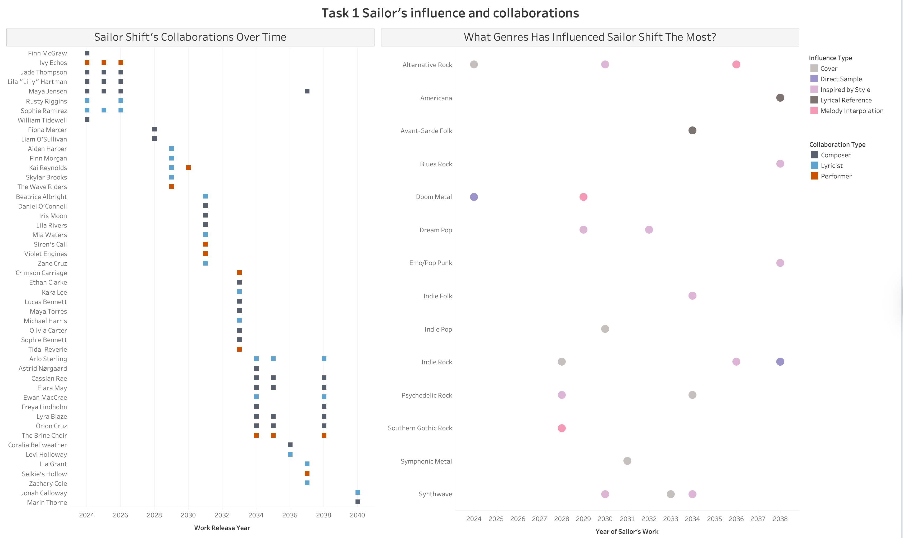
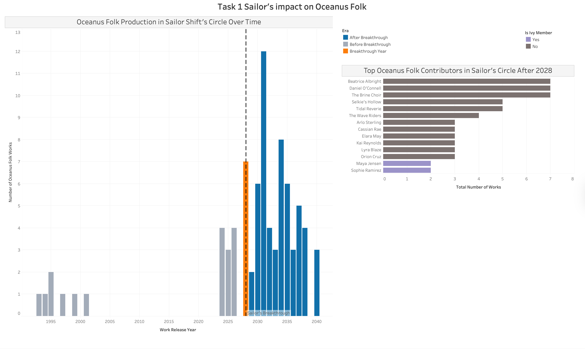
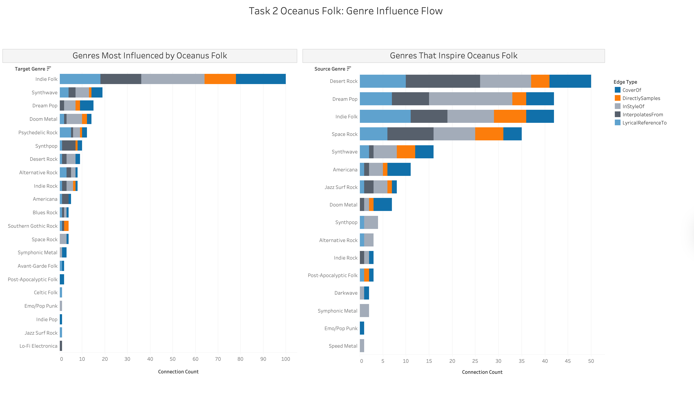
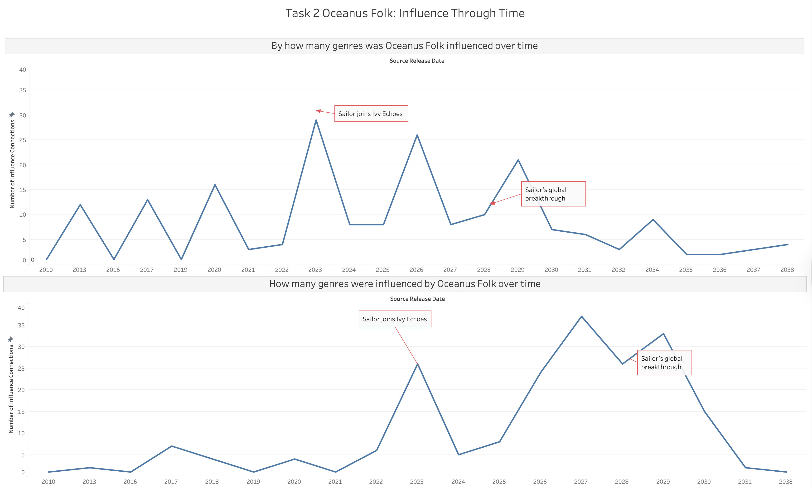
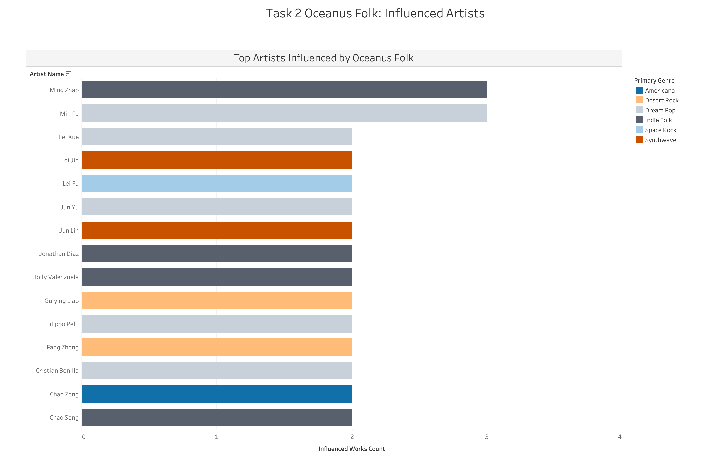
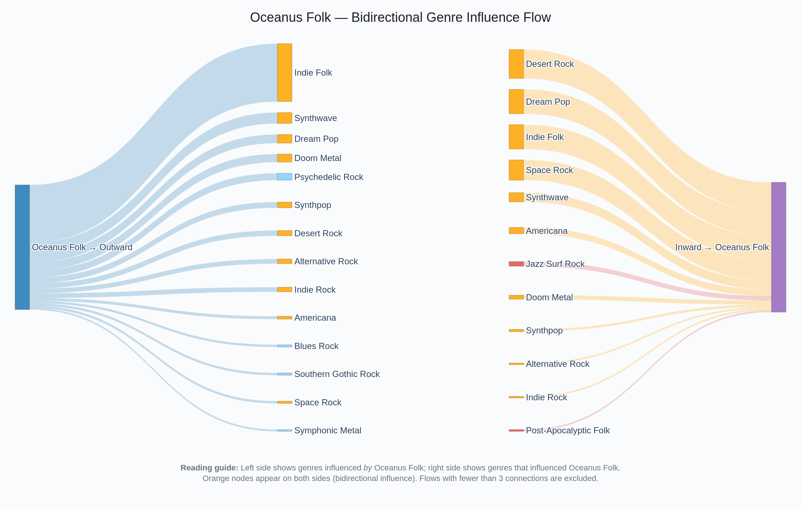
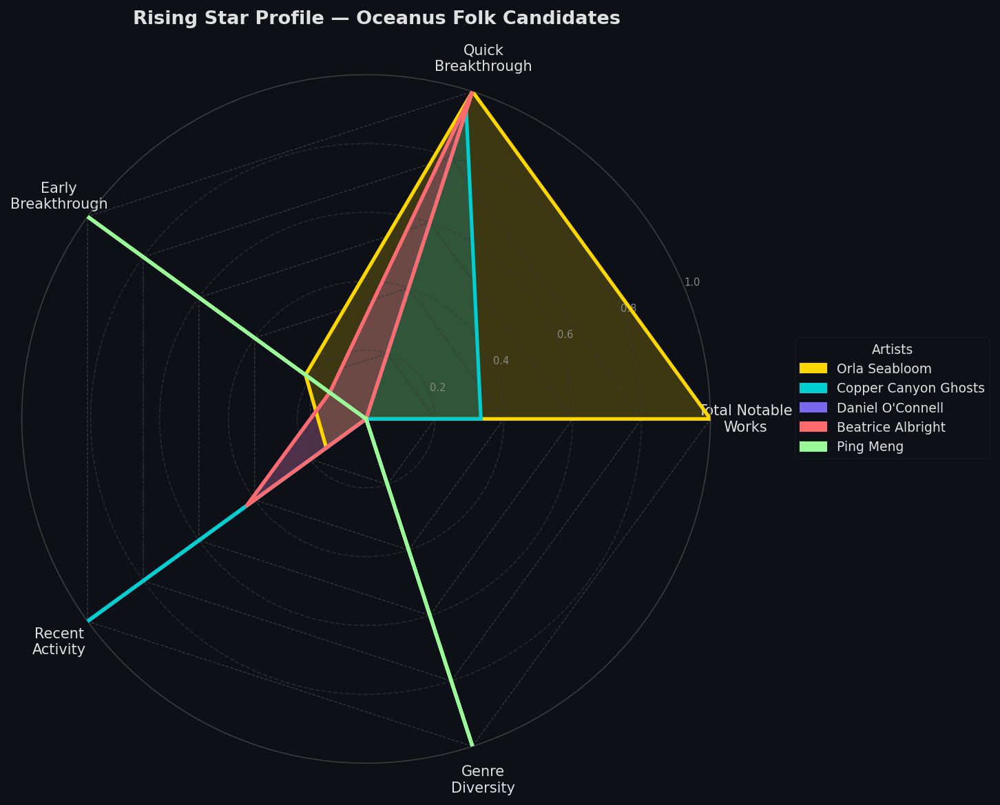
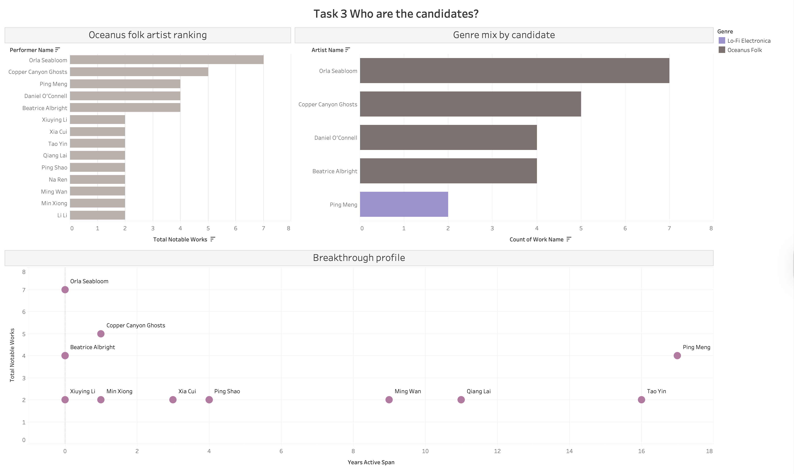
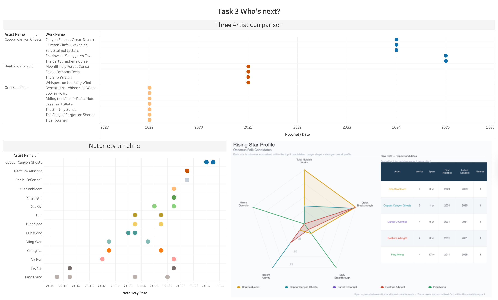

## Task 1 — Sailor Shift Career Profile

> See [Methodology](methodology.qmd) for data preparation details.

{width=100%}

## Sub-question 1: Who has she been most influenced by over time?

The bottom-left chart of the dashboard above maps Sailor Shift's sources of inspiration across time. Each dot represents an influence relationship between one of Sailor's works (X-axis = release year) and its source of inspiration (Y-axis = musical genre). The color indicates the type of influence.

Sailor Shift's inspiration comes from a large sample of musical genres, 14 of them, ranging from Doom Metal to Synthwave and Indie Folk. From 2028, the year of her global breakthrough, influences diversified and intensified significantly. The dominant influence type is her getting inspired by the style of many genres, suggesting Sailor consistently reinterprets frameworks rather than copying existing works.

Undocumented inspirations are not reflected, which may underrepresent Sailor's musical influences.

The dataset does not directly link her works to specific artists as sources of inspiration, only to songs, albums, and musical groups.

While it is possible to trace the performers and composers behind those works, this yields 87 largely anonymous individuals with no clear way to identify the most influential artists. As a result, this visualization answers 'what genres' influenced Sailor rather than 'who specifically' influenced her.

## Sub-question 2: Who has she collaborated with and directly or indirectly influenced?

### Collaborations

The top chart of the dashboard above shows all her collaborations with other artists across her career timeline and the type of collaboration. Each row represents a collaborator, each square the year of the collaboration, and the colors distinguish the different types. Multiple squares on the same line indicate a recurring collaboration.

From 2024 to 2026, her circle is tight and centered around Ivy Echoes members (Maya Jensen, Jade Thompson, Lila "Lilly" Hartman, and Sophie Ramirez), reflecting her early band period. The band then broke up, and she had a solo breakthrough year in 2028. From now on, an entirely new wave of collaborators emerges, growing and changing through the years. This suggests that Sailor's rise attracted a more diverse network of collaborators, transitioning her from a band artist to a cooperative one.

The dataset only captures formal creative credits (composer, lyricist, performer), limiting the non-formal reality of collaborations across the music environment.

### Influence

The bottom-right chart of the dashboard above identifies who Sailor has influenced. Each bar represents someone who referenced Sailor's work, and the color distinguishes between direct influence (the entity referenced Sailor herself or her work) and indirect influence (the entity referenced Ivy Echoes or Sailor's collaborators). The X-axis represents the number of times that each artist was linked to Sailor (documented).

Sailor Shift's influence reaches 27 distinct entities from a wide range of genres including Oceanus Folk, Indie Rock, Jazz, and Surf Rock. The first four entities show both direct and indirect influences, suggesting that they are the most involved in Sailor's artistic circle. The vast majority were influenced indirectly, highlighting that Sailor's impact on the music world propagates mainly through her collaborative network rather than through direct artistic borrowing.

The scale of influence is limited to what is formally documented, many other artists around the world could have been influenced by her without expressing it directly.

### Interactive Network Graphs

Click any node to highlight its neighbourhood. Hover over nodes for labels and relationship details.

```{=html}
<iframe src="images/task1/task1_collaboration_network.html" width="100%" height="600px" frameborder="0"></iframe>
```

Click any node to highlight its neighbourhood. Hover over nodes for labels and relationship details.

```{=html}
<iframe src="images/task1/task1_influence_network.html" width="100%" height="600px" frameborder="0"></iframe>
```

## Sub-question 3: How has she influenced collaborators of the broader Oceanus Folk community?

{width=100%}

### Left chart — Oceanus Folk Production Over Time

This chart tracks the volume of Oceanus Folk work produced annually within Sailor Shift's circle. The vertical line marks 2028, the year of her breakthrough, and the colors distinguish three eras: before breakthrough, breakthrough year, and after breakthrough. Each bar represents the number of distinct Oceanus Folk works released each year.

The data tells a story of exponential growth. Before 2028, Oceanus Folk production was small and irregular, rarely exceeding 2 works per year. During the breakthrough year, production immediately jumps to 7 works, nearly doubling the previous year's result. Post-2028, the number of works went up and peaked at 12 works in 2030, consistently remaining between 3 and 8 works per year. This pattern suggests that Sailor's rise made her collaborators produce more Oceanus Folk music, creating a renaissance of the genre.

The broader Oceanus Folk community outside her immediate circle is not included, meaning that the full impact is likely to be greater than what is shown here.

### Right chart — Top Contributors After 2028

This visualization complements the first one by ranking all Sailor's related artists who produced 3 or more Oceanus Folk works after her breakthrough. Each bar represents an artist, and its length shows the total number of works they produced. The color distinguishes Ivy Echoes members from the other collaborators. Only the artists with at least 3 works are shown on the graph, unless they are Ivy members.

We can see that her former bandmates are among the least productive contributors, with only 2 works each. In contrast, new collaborators such as Beatrice Albright, Daniel O'Connell, and The Brine Choir lead the chart with 7 works each. This suggests that her influence on the Oceanus Folk community operated by attracting new artists rather than reactivating her original bandmates. The chart indicates that Sailor's breakthrough created a wave of Oceanus Folk creativity beyond her founding circle.

The true community-wide impact is likely larger than what is shown since the visualization only includes artists directly connected to Sailor through some collaboration.

---

## Task 2 — Oceanus Folk Genre Spread

> See [Methodology](methodology.qmd) for data preparation details.

## Genre Influence Flow

{width=100%}

### Left chart — Genres Most Influenced by Oceanus Folk

A horizontal stacked bar chart showing target genres ranked by total connection count. Each color segment represents a different type of musical influence. Longer bar = stronger influence from Oceanus Folk on that genre. Each segment shows how the influence was expressed: CoverOf (Oceanus Folk songs were covered by this genre), DirectlySamples (Oceanus Folk audio was directly sampled), InStyleOf (works were created in the style of Oceanus Folk), InterpolatesFrom (melodies were borrowed from Oceanus Folk), LyricalReferenceTo (lyrics referenced Oceanus Folk works). The genres are sorted from most to least influenced — Indie Folk at the top is the most influenced genre.

### Right chart — Genres That Inspire Oceanus Folk

Same chart structure but showing which genres feed into Oceanus Folk. If a genre appears prominently on both sides it means there is a two-way musical exchange with Oceanus Folk. Desert Rock, Dream Pop and Indie Folk appearing on both sides confirms they have a bidirectional relationship with Oceanus Folk.

## Influence Through Time

{width=100%}

### Top chart — Oceanus Folk Outward Influence Over Time

A line chart where each point represents the number of influence connections made by Oceanus Folk works in that year. Higher points mean more Oceanus Folk works were influencing other genres that year. Two key events are marked directly on the chart: "Sailor joins Ivy Echoes" (2023) — marks the dramatic spike in outward influence; "Sailor's global breakthrough" (2028) — marks the second wave of sustained influence. The overall pattern shows influence was low and scattered before 2020, then triggered by Sailor's career milestones.

### Bottom chart — Other Genres Drawing from Oceanus Folk Over Time

Same structure but showing when other genres started drawing from Oceanus Folk. The top chart shows when Oceanus Folk influenced others, the bottom shows when others started recognising and drawing back from Oceanus Folk. The 2028 peak on the bottom chart is even more pronounced than on the top — confirming Sailor's breakthrough was the key trigger for external recognition.

## Top Influenced Artists

{width=100%}

A horizontal bar chart of the top 15 artists whose works were most influenced by Oceanus Folk, colored by their primary genre. Longer bar = more works influenced by Oceanus Folk. Each color represents the artist's primary genre, showing which genre communities were most receptive to Oceanus Folk's influence. The even bar lengths — most artists have 2–3 influenced works — confirm that Oceanus Folk's impact was broadly distributed across many artists rather than concentrated on a few. Dream Pop and Desert Rock dominate the top 15, consistent with the genre-level findings in the Genre Influence Flow dashboard.

## Bidirectional Genre Flow (Sankey Diagram)

{width=100%}

A flow diagram showing the two-way musical influence between Oceanus Folk and other genres simultaneously. Left blue node (Oceanus Folk → Outward) represents Oceanus Folk sending influence to other genres. Right purple node (Inward → Oceanus Folk) represents other genres sending influence back to Oceanus Folk. Middle nodes are individual genres positioned between the two anchor nodes. Band thickness indicates strength — thicker bands = stronger influence relationship. Orange nodes indicate genres with two-way exchange (both receiving and giving influence). Light blue nodes are genres that only receive influence from Oceanus Folk. Red/pink nodes are genres that only give influence to Oceanus Folk.

## Key Analytical Findings

| Question | Finding |
|---|---|
| Was influence gradual or intermittent? | Triggered — spiked dramatically in 2023 and 2028 aligned with Sailor's career milestones |
| Which genres were most influenced? | Indie Folk (~100 connections), followed by Synthwave, Dream Pop and Doom Metal |
| Which artists were most influenced? | Influence broadly distributed across 483 artists — no single dominant recipient |
| What inspires Oceanus Folk? | Desert Rock, Dream Pop, Indie Folk and Space Rock are the strongest inbound influences |
| Is the exchange bidirectional? | Yes — Indie Folk, Desert Rock, Dream Pop and Space Rock all show two-way exchange |
| When did external recognition begin? | 2007 — seven years after Oceanus Folk began referencing other genres in 2000 |

---

## Task 3 — Rising Star Prediction

> See [Methodology](methodology.qmd) for data preparation details.

## Visualisation — Tableau

**Sheet 1 — OF Artist Ranking** uses `task3_artist_notoriety` as its data source, with `Performer Name` on Rows, `SUM(Total Notable Works)` on Columns, and two filters applied: `Is Oceanus Folk Artist = True` and `SUM(Total Notable Works) >= 2`. This produces a horizontal bar chart ranking all 14 Oceanus Folk artists with two or more charted works, sorted in descending order by total works. The chart establishes the candidate pool for rising star prediction: Orla Seabloom leads with 7 notable works, followed by Copper Canyon Ghosts (5), Daniel O'Connell (4), Beatrice Albright (4), and Ping Meng (4). The remaining nine artists each have exactly 2 notable works.

**Sheet 2 — Genre Mix by Candidate** uses `task3_of_candidates` as its data source, with `Artist Name` on Rows, `CNT(Work Name)` on Columns, and `Genre` on the Colour mark. A filter on `CNT(Work Name)` restricts the view to the top five candidates with the highest work counts. This stacked bar chart reveals the genre composition of each candidate's notable output. All top candidates produce exclusively Oceanus Folk, with the exception of Ping Meng who has two Lo-Fi Electronica works and one Dream Pop work alongside a single Oceanus Folk work — identifying her as a genre-diverse outlier rather than a pure Oceanus Folk rising star.

**Sheet 3 — Notoriety Timeline** uses `task3_of_candidates` as its data source, with `Notoriety Date` on Columns (treated as a continuous dimension), `Artist Name` on Rows, `Artist Name` on the Colour mark, and `Work Name` on the Detail mark to plot one dot per notable work. A filter on `SUM(Total Notable Works) >= 2` retains the full 14-candidate pool. Rows are arranged so that artists with later career activity appear toward the top. This dot plot reveals the temporal distribution of each artist's chart appearances — distinguishing between artists who achieved notoriety in a concentrated burst (Orla Seabloom with all 7 works charting in 2029, Beatrice Albright with 4 works in 2031) and those whose careers span many years (Ping Meng from 2011 to 2028, Tao Yin from 2013 to 2029).

**Sheet 4 — Three Artist Comparison** uses `task3_of_candidates` as its data source, with `Notoriety Date` on Columns (continuous), `Artist Name` and `Work Name` on Rows, and `Artist Name` on the Colour mark. An `Artist Name` filter selects only the three predicted rising stars: Copper Canyon Ghosts, Beatrice Albright, and Orla Seabloom. This sheet provides a detailed work-by-work comparison of each prediction's career trajectory, showing the title and chart year of every notable work side by side.

**Sheet 5 — Breakthrough Profile** uses `task3_artist_notoriety` as its data source, with `Years Active Span` on Columns, `SUM(Total Notable Works)` on Rows, `Performer Name` on the Label mark, and a Circle mark type. Filters are `Is Oceanus Folk Artist = True` and `SUM(Total Notable Works) >= 2`. The x-axis begins at 0. This scatter plot positions each of the 14 candidates by how long they were active before charting (x-axis) against how many works they have charted (y-axis). Artists in the top-left region — high output with a short active span — represent the ideal rising star profile. Orla Seabloom occupies this position most strongly (7 works, 0-year span), while Ping Meng sits as an extreme outlier in the top-right (4 works, 17-year span), indicating a long and slow career rather than a rapid breakout.

## Visualisation — Python Radar Chart

{width=100%}

A radar chart was generated in Python using `matplotlib` (`Data/task3_radar.py`) to compare the top five Oceanus Folk candidates across five normalised dimensions simultaneously — a multi-axis comparison that cannot be achieved natively in Tableau.

The top five candidates by `total_notable_works` were selected from `task3_artist_notoriety`: Orla Seabloom (7), Copper Canyon Ghosts (5), Daniel O'Connell (4), Beatrice Albright (4), and Ping Meng (4).

Five metrics were defined and min–max normalised within this five-artist pool:

| Metric | Field | Direction |
|--------|-------|-----------|
| Total Notable Works | `total_notable_works` | Higher = better |
| Quick Breakthrough | `years_active_span` (inverted) | Lower span = higher score |
| Early Breakthrough | `first_notoriety_date` (inverted) | Earlier year = higher score |
| Recent Activity | `latest_notoriety_date` | Later year = higher score |
| Genre Diversity | Count of unique genres in `genres` field | More genres = higher score |

Normalisation was scoped to the five-candidate pool rather than the full dataset, so each radar axis represents relative standing among the top candidates. The chart was saved as a PNG at 150 dpi and embedded as a static image in the Tableau dashboard alongside a companion data table showing the raw values.

## Dashboards

{width=100%}

**Dashboard 1 — "Who are the Candidates?"** combines three sheets in a tiled layout: the OF Artist Ranking bar chart (top-left), the Genre Mix by Candidate stacked bar (top-right), and the Breakthrough Profile scatter plot (bottom, spanning full width). Together, these three views answer the question of which Oceanus Folk artists form the candidate pool and how they compare on output volume, genre focus, and breakthrough speed.

{width=100%}

**Dashboard 2 — "Who's Next?"** combines the Three Artist Comparison dot plot (top-left), the Notoriety Timeline (bottom-left), and the radar chart image (right). This dashboard presents the final predictions. The Three Artist Comparison provides a detailed work-by-work timeline for the three predicted stars, the Notoriety Timeline provides broader context by showing all 14 candidates, and the radar chart synthesises the five key metrics into a single comparative profile for the top five.

## Results and Discussion

### What does it mean to be a rising star?

Based on the visualisations above, a rising star in the Oceanus Folk music scene is characterised by five attributes:

1. **High notable output** — the artist has multiple works that achieved chart notoriety, not just a single hit. Among the 56 Oceanus Folk artists in the dataset, only 14 produced two or more notable works, and the strongest candidates produced four or more.

2. **Rapid breakthrough** — the time between the artist's first release and their first chart appearance is short. Orla Seabloom and Beatrice Albright both have a years-active span of zero, meaning their works charted in the same year they were released. Copper Canyon Ghosts achieved a span of just one year. By contrast, Ping Meng's 17-year span and Tao Yin's 16-year span suggest established careers rather than breakout trajectories.

3. **Concentrated momentum** — rising stars tend to chart multiple works within a narrow time window rather than sporadically over many years. Orla Seabloom charted all 7 works in 2029; Beatrice Albright charted all 4 in 2031. This burst pattern signals a career inflection point — the hallmark of a rising star.

4. **Genre commitment** — the strongest Oceanus Folk candidates produce almost exclusively within the genre. Ping Meng, despite having 4 notable works, splits across Lo-Fi Electronica, Dream Pop, and Oceanus Folk — making her more of a genre-crossing veteran than a rising Oceanus Folk star.

5. **Recency** — artists whose chart activity is more recent are more likely to represent the next wave. Copper Canyon Ghosts' notoriety dates (2034–2035) are the most recent in the candidate pool, placing them at the frontier of the genre's evolution.

The Breakthrough Profile scatter plot captures attributes 1 and 2 directly: ideal candidates cluster in the top-left (high works, low span). The Notoriety Timeline captures attribute 3 visually through dot clustering. The Genre Mix chart captures attribute 4 through colour segmentation. The radar chart synthesises all five attributes into a single comparative shape — a larger, more balanced polygon indicates a stronger overall rising star profile.

### Three Artist Comparison

The three artists selected for detailed comparison are Orla Seabloom, Beatrice Albright, and Copper Canyon Ghosts. Each represents a distinct breakout pattern:

**Orla Seabloom** had the most explosive debut in the candidate pool — all 7 of her notable works (*Beneath the Whispering Waves*, *Ebbing Heart*, *Riding the Moon's Reflection*, *Seasheel Lullaby*, *The Shifting Sands*, *The Song of Forgotten Shores*, and *Tidal Journey*) charted in a single year (2029). Her radar profile is the largest overall shape, dominating the Total Notable Works axis and scoring maximally on Quick Breakthrough. However, because all works charted in the same year, her Recent Activity score is moderate — her last chart appearance was 2029, earlier than the other two predictions.

**Beatrice Albright** followed a similar concentrated pattern, charting 4 works (*Moonlit Kelp Forest Dance*, *Seven Fathoms Deep*, *The Siren's Sigh*, *Whispers on the Jetty Wind*) in 2031, all in Oceanus Folk. Her years-active span is also zero, giving her a strong Quick Breakthrough score. Her profile closely mirrors Orla Seabloom's shape on the radar chart, albeit smaller due to fewer total works.

**Copper Canyon Ghosts** charted 5 works across 2034–2035 (*Canyon Echoes, Ocean Dreams*; *Crimson Cliffs Awakening*; *Salt-Stained Letters*; *Shadows in Smuggler's Cove*; *The Cartographer's Curse*), all in Oceanus Folk. With only a 1-year span and the most recent notoriety dates in the entire candidate pool, Copper Canyon Ghosts score highest on Recent Activity. Their radar profile is the most balanced of the three, with strong scores across all axes except Early Breakthrough (since their career began later).

### Predictions — Next Three Oceanus Folk Stars

Based on the rising star profile defined above, the three artists predicted to be the next Oceanus Folk breakout stars over the next five years are:

1. **Copper Canyon Ghosts** — Their 5 notable works between 2034 and 2035, combined with a 1-year active span and pure Oceanus Folk output, make them the most recent breakout act in the candidate pool. Recency is a decisive factor for a forward-looking prediction: their chart activity is the newest of any candidate, giving them the strongest momentum heading into the next five years.

2. **Orla Seabloom** — With 7 notable works and an instant breakthrough in 2029, she has the highest volume and fastest rise of any Oceanus Folk candidate. Her concentrated output suggests an artist at the peak of a career inflection, and her exclusive focus on Oceanus Folk makes her the genre's most prolific emerging voice. She ranks second because her chart activity, while impressive, is five years older than Copper Canyon Ghosts'.

3. **Beatrice Albright** — With 4 works charting simultaneously in 2031 and zero years-active span, she demonstrates the same explosive breakout pattern as Orla Seabloom. Her exclusively Oceanus Folk catalogue and rapid rise make her a strong candidate to sustain chart presence in the coming years.

These three were chosen over Daniel O'Connell (who matches Beatrice Albright's numbers but shares the same 2031 burst, making them interchangeable on the available metrics) and Ping Meng (whose 17-year span and multi-genre output disqualify her from the rising star profile despite having 4 notable works).
